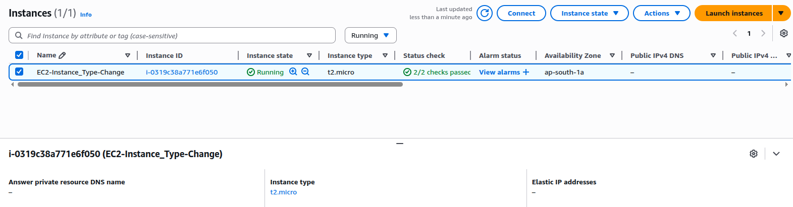
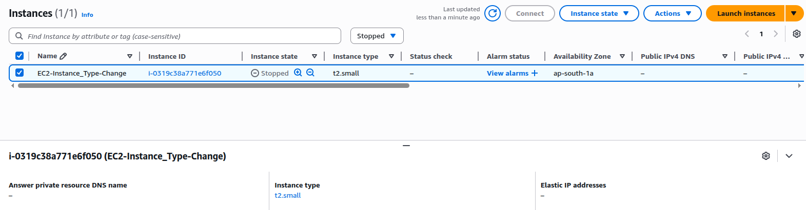
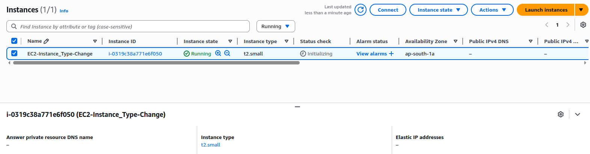

# Project 9: Change EC2 Instance Type

## Objective
Learn how to change the instance type of an EC2 instance (e.g., from t2.micro to t2.small).

---

## Steps
1. Launch an EC2 instance (Amazon Linux 2023, t2.micro).
2. Stop the instance from the EC2 console.
3. Go to **Actions → Instance Settings → Change Instance Type**.
4. Select a new instance type (e.g., t2.small).
5. Start the instance again.
6. Verify instance is running with the new type.

---

## Screenshots
- Instance in running state before change

- Change instance type option in console

- Instance running with new type after restart

---

## Key Learnings
- How to modify EC2 instance type
- Instance must be in stopped state before change
- Impact of instance type change on performance and billing
